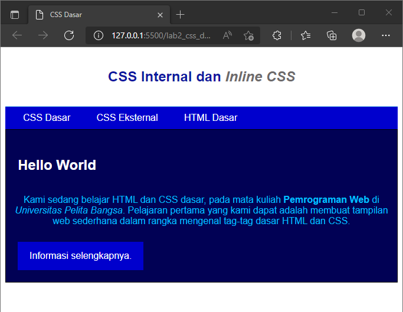

# Praktikum 2

## Profil
| | Biodata |
| -------- | --- |
| **Nama** | Humam Fathurrahman |
| **NIM** | 312010389 |
| **Kelas** | TI.20.A2 |
| **Mata Kuliah** | Pemrograman Web |


## 1. Membuat dokumen HTML
Pertama buatlah dokumen HTML seperti berikut
```html
<!DOCTYPE html>
<html lang="en">
<head>
    <meta charset="UTF-8">
    <meta http-equiv="X-UA-Compatible" content="IE=edge">
    <meta name="viewport" content="width=device-width, initial-scale=1.0">
    <title>CSS Dasar</title>
</head>
<body>
    <header>
        <h1>CSS Internal dan <i>Inline CSS</i></h1>
    </header>
    <nav>
        <a href="lab2_css_dasar.html">CSS Dasar</a>
        <a href="lab2_css_eksternal.html">CSS Eksternal</a>
        <a href="lab1_tag_dasar.html">HTML Dasar</a>
    </nav>
    <!-- CSS ID Selector -->
    <div id="intro">
        <h1>Hello World</h1>
        <p>Kami sedang belajar HTML dan CSS dasar, pada mata kuliah <b>Pemrograman
        Web</b> di <i>Universitas Pelita Bangsa</i>. Pelajaran pertama yang kami dapat
        adalah membuat tampilan web sederhana dalam rangka mengenal tag-tag dasar HTML
        dan CSS.</p>
    <!-- CSS Class Selector -->
    <a class="button btn-primary" href="#intro">Informasi selengkapnya.</a>
    </div>
</body>
</html>
```

Maka hasilnya sebagai berikut


## 2. Mendeklarasikan CSS Internal 

Tambahkan deklarasi CSS Internal pada bagian head dokumen HMTL

```html
<head>
    <meta charset="UTF-8">
    <meta http-equiv="X-UA-Compatible" content="IE=edge">
    <meta name="viewport" content="width=device-width, initial-scale=1.0">
    <title>CSS Dasar</title>
    <style>
        body {
            font-family:'Open Sans', sans-serif;
        }
        header {
            min-height: 80px;
            border-bottom:1px solid #77CCEF;
        }
        h1 {
            font-size: 24px;
            color: #0F189F;
            text-align: center;
            padding: 20px 10px;
        }
        h1 i {
            color:#6d6a6b;
        }
        </style>
</head>
```

Maka hasilnya sebagai berikut


## 3. Menambahkan Inline CSS

tambahkan deklarasi inline CSS pada tag ```<p>```

```css
<p style="text-align: center; color: #00bfff;">
```

Maka hasilnya sebagai berikut


## 4. Membuat CSS Internal 

buat file baru dengan nama **style_eksternal.css** , lalu buat deklarasi CSS 

```css
nav {
    background: #0000cd;
    color:#fff;
    padding: 10px;
    }
nav a {
    color: #fff;
    text-decoration: none;
    padding:10px 20px;
    }
nav .active, nav a:hover {
    background: #00000054;
    }
```

Lalu tambahkan tag ```<link>``` untuk mengarah file CSS yang sudah dibuat pada bagian ```<head>```

```html
<head>
    <!-- menyisipkan css eksternal -->>
    <link rel="stylesheet" href="style_eksternal.css">
</head>
```

Refresh kembali ke browser untuk melihat perubahannya, maka hasilnya sebagai berikut


## 5. Menambahkan CSS Selector

Selanjutnya menambahkan CSS Selector menggunakan ID dan Class Selector. Pada file
**style_eksternal.css**, tambahkan kode berikut.

```css
/* ID Selector */
#intro {
    background: #010155;
    border: 1px solid #000000;
    min-height: 100px;
    padding: 10px;
    }
#intro h1 {
    text-align: left;
    border: 0;
    color: #fff;
    }

/* Class Selector */
.button {
    padding: 15px 20px;
    background: #bebcbd;
    color: #fff;
    display: inline-block;
    margin: 10px;
    text-decoration: none;
    }
.btn-primary {
    background: #0000cd;
    }
```

Kemudian simpan kembali dan refresh browser untuk melihat perubahannya.

  


## Pertanyaan dan Tugas

### 1. Lakukan eksperimen dengan mengubah dan menambah properti dan nilai pada kode CSS dengan mengacu pada CSS cheat sheet yang diberikan pada file terpisah dari modul ini

Jawab

Saya mengubah warna pada internal CSS ```h1 i```  dan menambahkan ```border-radius: 4px;``` pada Eksternal CSS ```nav .active, nav a:hover``` dan di class selector button.

Berikut codingan yang saya tambahkan dan ubah.
```css
h1 i {
    color: #5560ff;
    }
nav .active, nav a:hover {
    background: #00000054;
    border-radius: 4px;
    }
.button {
    border-radius: 4px;
    padding: 15px 20px;
    background: #bebcbd;
    color: #fff;
    display: inline-block;
    margin: 10px;
    text-decoration: none;
    }    
```

Hasilnya sebagai berikut.


### 2. Apa perbedaan pendeklarasian CSS elemen {h1} dengan {#intro h1} berikan penjelasan nya!

Jawab

Jadi jika mendeklarasikan h1 nya saja itu akan mengubah semua elemen {h1}, sedangkan jika mendeklarasikan {#intro h1} itu hanya mengubah elemen {h1} pada {#intro} saja.

### 3. Apabila ada deklrasi CSS secara internal,lalu ditambahkan CSS Eksternal dan inline CSS pada elemen yang sama. Deklarasi manakah yang akan ditampilkan pada browser ? Berikan penjelasan dan contoh nya

Jawab

Jika mendeklarasikan **Internal**, **Eksternal** dan **Inline** secara bersamaan yang akan ditampilkan pada Browser adalah **Inline**, Karena **Inline** Memiliki prioritas dibanding **Eksternal** atau pun **Internal**. Saya akan membuat dokumen baru HTML, kemudian saya buat Elemen **{h2}**, kemudian saya deklarasikan di CSS **Internal** **Eksternal** dan juga **Inline**, dengan menggunakan properti **{color}** yang berbeda, jika **Internal** {color: yellow} sementara **Eksternal** {color: brown;} dan **Inline** {color: blue;} yang terpanggil dibrowser adalah **Inline** karena memiliki prioritas.
Berikut contohnya


Berikut codingannya


### 4. Pada sebuah elemen HTML terdapat ID dan Class,apabila masing-masing selector tersebut terdapat deklarasi CSS , maka deklarasi manakah yang akan ditampilkan pada browser? Berikan penjelasan dan contohnya!
```html
(<p id="paragraf-1" class="text-paragraf">)
```

Jawab

Yang ditampilkan dibrowser adalah ID, ID bersifat unik berbeda dengan Class, Class bisa digunakan banyak, sementara ID hanya tertentu saja, oleh karena itu ID yang ditampilkan dibrowser.


Diatas, saya menambahkan properti {color} untuk ID {color: blue} sementara Class {color: red} namun yang terpanggil di browser adalah ID yang properti nya {color: blue}
